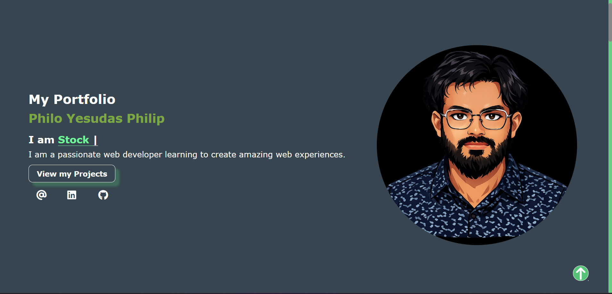
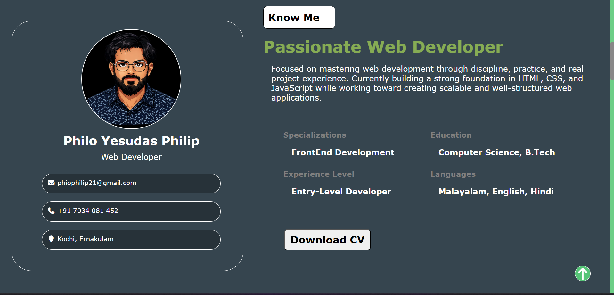
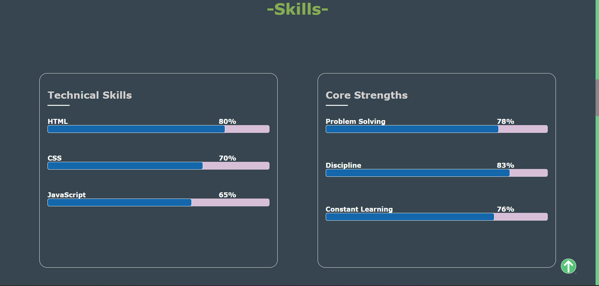
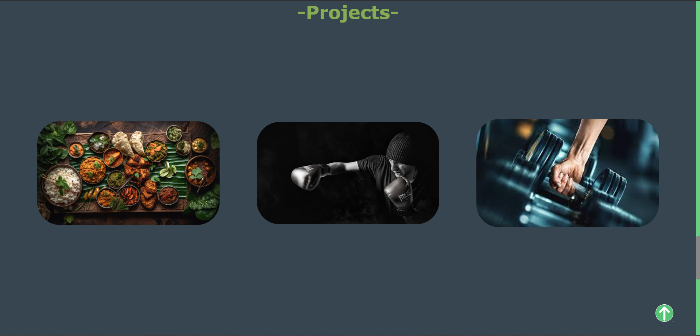
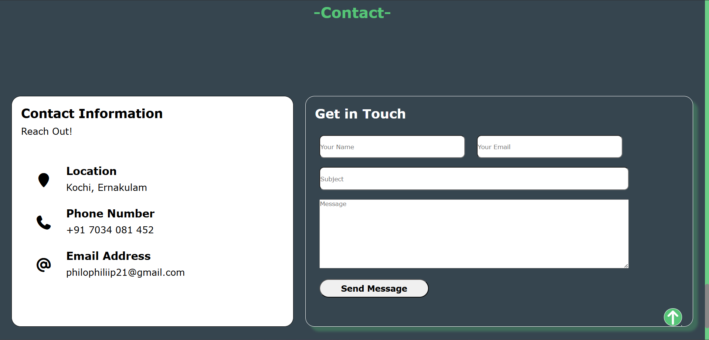

# Personal Portfolio Website

## Overview

This project is my **first personal developer portfolio website**, built using **HTML5 and CSS3**.
It showcases my skills, experience, and projects as I begin my journey toward becoming a **Full Stack Developer**.

This portfolio will continue to evolve as I learn new technologies and improve my development skills.

---

## Version

**v1.0 — Initial Release**

Current version includes:

* HTML structure
* CSS styling
* Skill progress bars
* Resume / experience section
* Project showcase section
* Contact section
* Smooth scroll navigation
* Custom scrollbar design
* Hover interactions

Future updates will include **JavaScript features and UI improvements**.

---

## Features

* Responsive portfolio layout
* Technical skills progress bars
* Experience timeline section
* Project showcase cards
* Contact information section
* Smooth scroll navigation
* Interactive hover effects

---

## Technologies Used

* **HTML5**
* **CSS3**
* **Font Awesome Icons**

---

## Screenshots

### Hero Section

### About Section

### Skills Section

## Resume

### Resume Page 1

### Resume Page 2

### Resume Page 3

### Projects Section

### Contact Section

---

## Planned Improvements (v1.1)

* Add **JavaScript interactions**
* Dark mode toggle
* Improved animations
* Better mobile responsiveness
* Project filtering system

---

## Purpose

The purpose of this project is to:

* Practice **frontend web development**
* Apply **HTML and CSS concepts**
* Build a **real-world project**
* Track my progress as I grow as a developer

---

## Author

**Philo Yesudas Philip**

Aspiring **Full Stack Developer** currently focusing on mastering:

* Web Development (MERN Stack)
* Software Engineering Fundamentals
* Real-world project building

---

## Future Roadmap

This portfolio will evolve alongside my learning journey:

v1.0 → HTML + CSS Portfolio
v1.1 → JavaScript Enhancements
v2.0 → React Portfolio Upgrade
